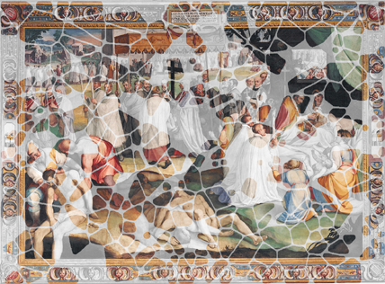

# Reconstruction of frescoes by sequential layers of feature extraction

This repository contains the code developed for the [Digital Anastylosis of Frescoes challeNgE DAFNE](https://vision.unipv.it/DAFchallenge/DAF-notice.html) hosted by the Università degli Studi di Pavia.

Within this codebase, you'll find the implementation of two innovative methods:

- [Retention Layers Method](https://github.com/teixeirazeus/Reconstruction-of-frescoes-by-sequential-layers-of-feature-extraction/blob/main/prometeu.py#L24)
- [Middle Triangle Method](https://github.com/teixeirazeus/Reconstruction-of-frescoes-by-sequential-layers-of-feature-extraction/blob/main/tools.py#L67)

I do not intend to provide updates to the code; I am merely archiving it and making it available for other researchers.

For a detailed understanding of these methods, please refer to our published [paper](https://www.sciencedirect.com/science/article/abs/pii/S0167865521001422) or my [Bachelor's Thesis](https://repositorio.utfpr.edu.br/jspui/handle/1/26470) in portuguese.